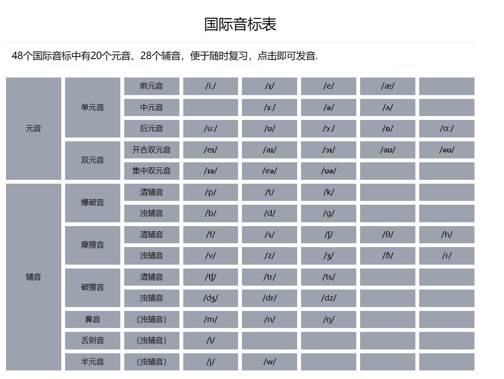

# 英音音标发音表
---

-------------------------
## 英音音标发音表网址(https://april727.github.io/Phonetic-chart/)

## 素材来源

1. 元音素材
	- [**BBC** Learning English](https://www.youtube.com/watch?v=TNFKG0yvDx4&list=PLD6B222E02447DC07)
2. 辅音素材
	- [**mmmEnglish**](https://www.youtube.com/watch?v=n4NVPg2kHv4)
	- [**英语兔**](https://www.bilibili.com/video/BV1vi4y1C73C/?spm_id_from=333.788.recommend_more_video.8&vd_source=98badb5f3f8dc80b4aaf167083a844d7)
	
